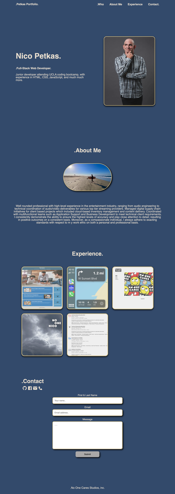

# npetkas-portfolio

## Description 

This project was created in order to present a nice, well layed out portfolio that is easily navigatable, readable, and clean. This project demonstrates my knowledge, experience, and design quality I can bring to a project or potential employer. It also helped me understand the mass amount of design possibilities using CSS, while the importance of having a well structured html to back it up with is fundamental. Through is build, I learned CSS design layout, design effects, and the importance of not having redundant code. 

## Link to deploy application

[Portfolio][def]

[def]: https://nicoinlalaland.github.io/npetkas-portfolio/